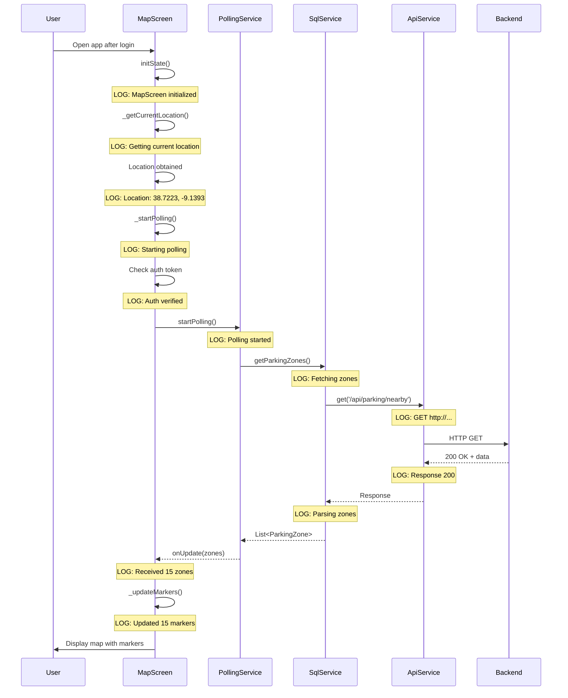
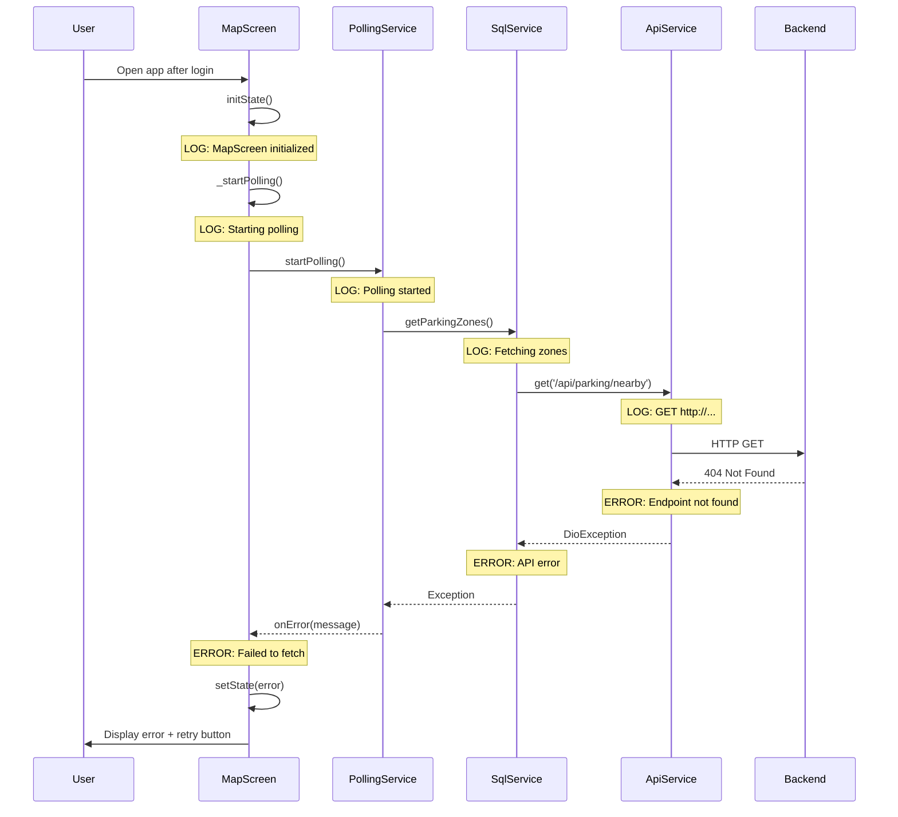

# Design Document

## Overview

This design addresses the issue where parking zones fail to load after successful authentication. The problem manifests as the MapScreen remaining in a loading state indefinitely with no visible API calls to `/api/spots`. The solution involves adding comprehensive debug logging throughout the parking zone fetch pipeline and implementing proper error handling to surface silent failures.

The design focuses on three key areas:

1. **Enhanced logging** in PollingService, SqlService, and MapScreen to trace the data flow
2. **Error detection and reporting** to identify where the fetch process fails
3. **User feedback mechanisms** to communicate errors and provide recovery options

## Architecture

### Current Flow (Problematic)

```
MapScreen.initState()
  └─> _getCurrentLocation()
      └─> _startPolling()
          └─> PollingService.startPolling()
              └─> _fetchParkingZones()
                  └─> SqlService.getParkingZones()
                      └─> ApiService.get('/api/parking/nearby')
                          └─> [SILENT FAILURE - No logs, no error handling]
```

### Enhanced Flow (With Debugging)

```
MapScreen.initState()
  ├─> [LOG] MapScreen initialized
  └─> _getCurrentLocation()
      ├─> [LOG] Getting current location
      ├─> [LOG] Location obtained: lat, lng
      └─> _startPolling()
          ├─> [LOG] Starting polling at location
          ├─> [CHECK] Verify online status
          ├─> [CHECK] Verify authentication token
          └─> PollingService.startPolling()
              ├─> [LOG] Polling service started
              └─> _fetchParkingZones()
                  ├─> [LOG] Fetching parking zones
                  └─> SqlService.getParkingZones()
                      ├─> [LOG] API request: GET /api/parking/nearby
                      ├─> [LOG] Query params: lat, lng, radius, limit
                      └─> ApiService.get()
                          ├─> [LOG] Full URL with base
                          ├─> [LOG] Response status: 200/404/500
                          ├─> [LOG] Response data structure
                          ├─> [ERROR] Network error (if any)
                          └─> [ERROR] Parsing error (if any)
```

## Components and Interfaces

### 1. Enhanced PollingService

**Purpose:** Add lifecycle and state logging to track polling initialization and execution.

**Changes:**

- Add logging when `startPolling()` is called with parameters
- Add logging when `stopPolling()` is called
- Add logging before and after `_fetchParkingZones()` execution
- Add logging for successful zone updates and error callbacks
- Add state tracking to log whether polling is active

**New Methods:**

```dart
void _logPollingState() {
  LoggerService.debug(
    'Polling state: ${isPolling ? "active" : "inactive"}',
    component: 'PollingService',
  );
}
```

### 2. Enhanced SqlService

**Purpose:** Add detailed API request/response logging to identify endpoint and data issues.

**Changes:**

- Add logging at the start of `getParkingZones()` with all parameters
- Add logging of the complete API endpoint URL being called
- Add logging of query parameters being sent
- Add logging of response status code and data structure
- Add enhanced error logging with specific error types (network, parsing, etc.)
- Add validation logging for response data format

**Key Logging Points:**

```dart
Future<List<ParkingZone>> getParkingZones(...) async {
  LoggerService.debug(
    'Fetching parking zones: lat=$latitude, lng=$longitude, radius=$radius, limit=$limit',
    component: 'SqlService',
  );

  try {
    // Log the actual endpoint being called
    LoggerService.debug(
      'API call: GET /api/parking/nearby',
      component: 'SqlService',
    );

    final response = await _apiService.get(...);

    // Log response details
    LoggerService.debug(
      'Response received: status=${response.statusCode}, data type=${response.data.runtimeType}',
      component: 'SqlService',
    );

    // ... rest of implementation
  } catch (e, stackTrace) {
    LoggerService.error(
      'Failed to fetch parking zones',
      error: e,
      stackTrace: stackTrace,
      component: 'SqlService',
    );
    throw;
  }
}
```

### 3. Enhanced MapScreen

**Purpose:** Add state transition logging and authentication verification.

**Changes:**

- Add logging when polling starts/stops
- Add logging to verify authentication token exists before polling
- Add logging for connectivity state changes
- Add logging when zones are received and markers are updated
- Add logging for error states
- Enhance error display to show specific error types

**Authentication Check:**

```dart
void _startPolling() {
  // Check authentication
  final token = ApiService().getToken();
  if (token == null || token.isEmpty) {
    LoggerService.warning(
      'Cannot start polling: No authentication token',
      component: 'MapScreen',
    );
    setState(() {
      _error = 'Authentication required. Please log in again.';
      _isLoading = false;
    });
    return;
  }

  LoggerService.debug(
    'Authentication verified, token present',
    component: 'MapScreen',
  );

  // ... rest of implementation
}
```

### 4. Enhanced ApiService

**Purpose:** Add base URL logging and request/response details.

**Changes:**

- Add logging of the complete request URL (base + endpoint)
- Add logging of authentication headers (without exposing token value)
- Add logging of request timeout settings
- Add logging of response data structure before parsing

**Key Addition:**

```dart
Future<Response> get(String endpoint, ...) async {
  final fullUrl = '$baseUrl$endpoint';
  LoggerService.debug(
    'API GET: $fullUrl',
    component: 'ApiService',
  );

  LoggerService.debug(
    'Auth header: ${_dio.options.headers.containsKey('Authorization') ? 'present' : 'missing'}',
    component: 'ApiService',
  );

  // ... rest of implementation
}
```

## Data Models

No changes to existing data models. The focus is on observability, not data structure.

### Logging Data Structure

Each log entry will follow this format:

```
[Component] Message
```

Examples:

```
[MapScreen] MapScreen initialized
[MapScreen] Starting polling at location: 38.7223, -9.1393
[PollingService] Polling service started with interval: 30s
[SqlService] Fetching parking zones: lat=38.7223, lng=-9.1393, radius=5.0, limit=50
[SqlService] API call: GET /api/parking/nearby
[ApiService] API GET: http://192.168.1.67:3000/api/parking/nearby?lat=38.7223&lng=-9.1393&radius=5.0&limit=50
[ApiService] Auth header: present
[SqlService] Response received: status=200, data type=_Map<String, dynamic>
[SqlService] Parsing 15 parking zones
[MapScreen] Received 15 parking zones
[MapScreen] Updated 15 markers on map
```

## Error Handling

### Error Categories

1. **Authentication Errors**

   - Missing token
   - Expired token
   - Invalid token
   - Action: Prompt user to log in again

2. **Network Errors**

   - No connectivity
   - Timeout
   - DNS resolution failure
   - Action: Show offline indicator, queue retry

3. **API Errors**

   - 404 Not Found (endpoint doesn't exist)
   - 500 Internal Server Error
   - 401 Unauthorized
   - Action: Show specific error message with retry option

4. **Data Parsing Errors**
   - Invalid response format
   - Missing required fields
   - Type mismatch
   - Action: Log detailed error, show generic error to user

### Error Flow

```dart
try {
  // Attempt operation
} on DioException catch (e) {
  if (e.type == DioExceptionType.connectionTimeout) {
    LoggerService.error('Connection timeout', component: 'SqlService');
    throw Exception('Request timed out. Please check your connection.');
  } else if (e.type == DioExceptionType.connectionError) {
    LoggerService.error('Connection error', component: 'SqlService');
    throw Exception('Unable to connect to server. Please check your network.');
  } else if (e.response?.statusCode == 401) {
    LoggerService.error('Unauthorized', component: 'SqlService');
    throw Exception('Authentication required. Please log in again.');
  } else if (e.response?.statusCode == 404) {
    LoggerService.error('Endpoint not found: ${e.requestOptions.path}', component: 'SqlService');
    throw Exception('Service endpoint not available.');
  } else {
    LoggerService.error('API error: ${e.message}', error: e, component: 'SqlService');
    throw Exception('Failed to fetch parking zones: ${e.message}');
  }
} catch (e, stackTrace) {
  LoggerService.error('Unexpected error', error: e, stackTrace: stackTrace, component: 'SqlService');
  throw Exception('An unexpected error occurred: $e');
}
```

## Testing Strategy

### Manual Testing Workflow

1. **Build and Install Debug APK**

   ```bash
   flutter build apk --debug
   adb install -r build/app/outputs/flutter-apk/app-debug.apk
   ```

2. **Start Log Capture**

   ```bash
   adb logcat -c  # Clear logs
   adb logcat | grep -E "MotorbikeParking|flutter" > debug_session.log
   ```

3. **Test Scenarios**

   **Scenario A: Normal Flow**

   - Launch app
   - Log in with valid credentials
   - Observe MapScreen loading
   - Expected logs:
     - MapScreen initialized
     - Getting current location
     - Location obtained
     - Starting polling
     - Authentication verified
     - Polling service started
     - Fetching parking zones
     - API call: GET /api/parking/nearby
     - Response received
     - Received X parking zones
     - Updated X markers

   **Scenario B: Missing Authentication**

   - Clear app data
   - Launch app without logging in
   - Expected logs:
     - Cannot start polling: No authentication token
     - Error displayed to user

   **Scenario C: Network Offline**

   - Enable airplane mode
   - Launch app
   - Expected logs:
     - Connectivity status: offline
     - Cannot start polling while offline
     - Offline indicator shown

   **Scenario D: API Endpoint Error**

   - Modify backend to return 404 for /api/parking/nearby
   - Launch app and log in
   - Expected logs:
     - API call: GET /api/parking/nearby
     - Endpoint not found
     - Error displayed with retry button

### Log Analysis

After each test scenario, analyze logs for:

- Complete flow execution (no gaps)
- Proper error handling (errors are caught and logged)
- User feedback (errors result in UI updates)
- State transitions (loading → success/error)

### Success Criteria

- All log points are visible in logcat
- Errors are caught and logged with stack traces
- User sees appropriate error messages
- Retry mechanism works correctly
- Authentication issues are detected and reported

## Implementation Notes

### Logging Best Practices

1. **Use appropriate log levels:**

   - `debug()` for detailed flow information
   - `info()` for important state changes
   - `warning()` for recoverable issues
   - `error()` for failures requiring attention

2. **Include context:**

   - Always specify component name
   - Include relevant parameters (lat, lng, etc.)
   - Log both input and output of operations

3. **Avoid sensitive data:**

   - Never log full authentication tokens
   - Log only token presence/absence
   - Sanitize user data in logs

4. **Performance considerations:**
   - Logs are only active in debug/profile modes
   - Use conditional logging for verbose operations
   - Avoid logging in tight loops

### Backward Compatibility

All changes are additive (logging only). No breaking changes to:

- Method signatures
- Return types
- Class interfaces
- Data models

Existing functionality remains unchanged; we're only adding observability.

## Deployment

### Phase 1: Add Logging (This Spec)

- Enhance PollingService with lifecycle logging
- Enhance SqlService with API request/response logging
- Enhance MapScreen with state transition logging
- Enhance ApiService with URL and auth logging

### Phase 2: Fix Root Cause (Future Spec)

Once logs reveal the root cause:

- Fix the identified issue (e.g., wrong endpoint, missing auth, etc.)
- Add proper error handling
- Implement retry logic if needed

### Phase 3: Improve Logging System (Existing Spec)

- Implement fix-flutter-logging spec
- Replace `developer.log()` with `debugPrint()` and `print()`
- Ensure all logs are visible in logcat

## Diagrams

### Sequence Diagram: Successful Parking Zone Fetch



### Sequence Diagram: Failed Parking Zone Fetch



## Dependencies

- Existing LoggerService (lib/services/logger_service.dart)
- Existing PollingService (lib/services/polling_service.dart)
- Existing SqlService (lib/services/sql_service.dart)
- Existing ApiService (lib/services/api_service.dart)
- Existing MapScreen (lib/screens/map_screen.dart)

No new dependencies required.

## Risk Assessment

### Low Risk

- Adding logging is non-invasive
- No changes to business logic
- No changes to data flow
- Easy to rollback (remove log statements)

### Potential Issues

- Increased log volume may impact performance in debug mode
  - Mitigation: Logs are already conditional on debug mode
- Sensitive data exposure in logs
  - Mitigation: Explicitly avoid logging tokens and user data

## Future Enhancements

1. **Structured Logging**

   - JSON-formatted logs for easier parsing
   - Log aggregation service integration

2. **Performance Metrics**

   - Track API response times
   - Monitor polling intervals
   - Measure marker update performance

3. **Remote Logging**

   - Send error logs to backend for analysis
   - Crash reporting integration (Firebase Crashlytics)

4. **User-Facing Diagnostics**
   - In-app log viewer for support
   - Network diagnostics screen
   - Connection quality indicator
